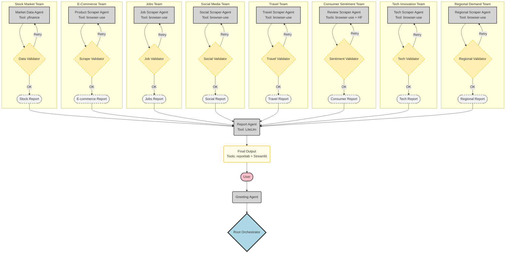

# Mult## 🎓 Academic Project Details

- **Institution**: Indian Institute of Technology Ropar
- **Course**: Final Semester Module
- **Project Type**: Multi-Agent System Architecture
- **Framework**: Google Agent Development Kit (ADK)
- **Architecture Pattern**: Sequential + Loop Agent Orchestration

## 🚀 10-Day AI Challenge

This project is part of my **10-Day Challenge** to build a complete AI agentic market trend analysis system from scratch! Follow the journey as I develop each domain team, implement advanced agent patterns, and create a production-ready multi-agent system.

### 📈 Active Development Status
- ⭐ **Star this repository** to follow real-time development progress
- 🔄 **Active repo** with daily commits and feature additions
- 📊 **Live updates** on system architecture and new domain implementations
- 🎯 **Challenge goal**: Complete 8-domain analysis system in 10 days

### 📱 Follow My Journey

**📝 Medium Blog - Daily AI Updates**
- **Subscribe**: [https://medium.com/@srinivasvarma764](https://medium.com/@srinivasvarma764)
- Get daily updates on AI news, project progress, and technical insights
- In-depth articles on multi-agent systems and advanced AI architectures
- Behind-the-scenes development process and challenges faced

**💼 LinkedIn - Professional Updates**
- Follow my LinkedIn for professional updates and project milestones
- Connect with me for discussions on AI agent frameworks and system design
- Daily progress updates and technical achievements

**📊 Repository Updates**
- ⭐ **Star this repo** to stay notified of new features and improvements
- 👀 **Watch** for real-time commit notifications
- 🍴 **Fork** to experiment with your own domain implementationsn Trend Analysis System 🌐

**IIT Ropar Final Semester Project | Advanced AI Agent Framework**

A sophisticated multi-agent AI system for comprehensive trend analysis across 8 diverse domains using Google's Agent Development Kit (ADK). This system demonstrates advanced orchestration of Sequential and Loop agents with real-time data processing capabilities.

## � Academic Project Details

- **Institution**: Indian Institute of Technology Ropar
- **Course**: Final Semester Module
- **Project Type**: Multi-Agent System Architecture
- **Framework**: Google Agent Development Kit (ADK)
- **Architecture Pattern**: Sequential + Loop Agent Orchestration

## 🌟 System Features

### Core Capabilities
- **8 Domain Analysis**: Stock Market, E-commerce, Jobs, Social Media, Travel, Consumer Sentiment, Tech Innovation, Regional Demand
- **Intelligent Orchestration**: Root orchestrator with domain-specific routing
- **Self-Validating Agents**: Loop agents ensure data quality and retry failed operations
- **Real-time Processing**: Live data fetching from multiple sources
- **Interactive Output**: PDF reports + Streamlit dashboard
- **Modular Architecture**: Easily extensible agent-based design

### Technical Features
- **Multi-Agent Coordination**: Sequential and Loop agent patterns
- **Web Scraping**: Browser-use MCP for dynamic content extraction
- **Financial Analysis**: Technical indicators via pandas-ta and yfinance
- **Sentiment Analysis**: HuggingFace transformer models
- **Report Generation**: Automated PDF creation with reportlab
- **Interactive Dashboards**: Real-time visualization with Streamlit

## 🏗️ System Architecture

### Phase 1: Entry & Orchestration
```
User → Greeting Agent → Root Orchestrator → Domain Selection
```

### Phase 2: Domain-Specific Teams (8 Teams)
Each team follows the pattern: **Sequential Agent** → **Loop Agent** → **Validation**

1. **Stock Market Team**: Financial trend analysis with technical indicators
2. **E-Commerce Team**: Product trend detection and pricing analysis  
3. **Job Market Team**: Skill demand forecasting and market analysis
4. **Social Media Team**: Trending topics and hashtag analysis
5. **Travel Team**: Destination popularity and tourism trends
6. **Consumer Sentiment Team**: Review analysis and sentiment forecasting
7. **Tech Innovation Team**: Patent and technology trend mapping
8. **Regional Demand Team**: Local market spike detection

### Phase 3: Aggregation & Reporting
```
Team Reports → Report Agent → Output Agent → PDF + Dashboard
```

## 🔄 Agent Flow Architecture



## 🚀 Quick Start

### Prerequisites

- Python 3.8+
- OpenRouter API key (for LLM access)
- Internet connection (for real-time data scraping)
- Modern web browser (for browser-use MCP)

### Installation

1. **Clone the repository**:

   ```bash
   git clone https://github.com/Srinivas26k/Market-trend.git
   cd Market-trend
   ```

2. **Install dependencies**:

   ```bash
   pip install -r requirements.txt
   ```

3. **Set up environment variables**:

   ```bash
   # Create .env file
   echo "OPENROUTER_API_KEY=your_api_key_here" > .env
   ```

4. **Test the installation**:

   ```bash
   python test_stock_team.py
   ```

### Basic Usage

```python
from stock_market_team.agent import root_agent

# Initialize the multi-domain trend analysis system
# User selects domain through greeting agent interface
result = root_agent.process("Analyze current market trends")
print(result)
```

## 📦 Core Dependencies

### AI & Agent Framework
- **google-adk**: Google Agent Development Kit (Sequential/Loop agents)
- **litellm**: LLM integration layer for OpenRouter
- **mcp**: Model Context Protocol for tool integration

### Data Sources & Processing
- **yfinance**: Stock market data retrieval
- **pandas**: Data manipulation and analysis
- **pandas-ta**: Technical analysis indicators
- **requests**: HTTP client for API calls
- **requests-cache**: Caching for efficient data retrieval

### Web Scraping & Browser Automation
- **browser-use MCP**: Dynamic web content extraction
- **BeautifulSoup**: HTML parsing and scraping

### Sentiment Analysis & NLP
- **transformers**: HuggingFace model integration
- **torch**: PyTorch backend for ML models

### Output & Visualization
- **reportlab**: PDF report generation
- **streamlit**: Interactive dashboard creation
- **matplotlib/plotly**: Data visualization

### Utilities
- **python-dotenv**: Environment variable management
- **setuptools/wheel**: Package management


## 📊 Domain Analysis Capabilities

### 1. Stock Market Trends
- Real-time OHLCV data analysis
- Technical indicators (SMA, RSI, MACD)
- 52-week high/low tracking
- Volume analysis and price predictions

### 2. E-Commerce Product Trends
- Trending product detection
- Price movement analysis
- Market demand forecasting
- Competitive product tracking

### 3. Job Market Intelligence
- Skill demand forecasting
- Salary trend analysis
- Industry growth patterns
- Regional job market insights

### 4. Social Media Trends
- Hashtag popularity tracking
- Topic trend analysis
- Viral content detection
- Sentiment-driven insights

### 5. Travel & Tourism
- Destination popularity trends
- Seasonal travel patterns
- Price fluctuation analysis
- Tourism demand forecasting

### 6. Consumer Sentiment
- Product review analysis
- Brand sentiment tracking
- Purchase intention prediction
- Market reception analysis

### 7. Technology Innovation
- Patent filing trends
- Emerging technology mapping
- Innovation cycle analysis
- Tech adoption forecasting

### 8. Regional Market Analysis
- Local demand spike detection
- Regional preference analysis
- Geographic trend mapping
- Market penetration insights

## 🔧 System Configuration

### Environment Variables
- `OPENROUTER_API_KEY`: Required for LLM API access (OpenAI GPT models)

### Model Configuration
- Primary Model: `openai/gpt-4o-mini` via OpenRouter
- Sentiment Model: `distilbert-base-uncased-finetuned-sst-2-english`
- Fallback Model: `openrouter/openai/gpt-oss-20b:free`

### MCP Tools Configuration
Each domain team uses specific Model Context Protocol tools:
- **Stock Team**: yfinance + pandas-ta
- **E-Commerce Team**: browser-use MCP
- **Jobs Team**: browser-use MCP
- **Social Media Team**: browser-use MCP
- **Travel Team**: browser-use MCP
- **Consumer Team**: browser-use MCP + HuggingFace transformers
- **Tech Team**: browser-use MCP
- **Regional Team**: browser-use MCP

## 📁 Project Structure

```
Market-trend/
├── greeting_agent/
│   ├── .gitignore
│   ├── __init__.py
│   └── agent.py
├── stock_market_team/
│   ├── subagents/
│   │   ├── stock_data_analysis/
│   │   │   ├── .gitignore
│   │   │   ├── __init__.py
│   │   │   └── agent.py
│   │   ├── stock_data_retrieval/
│   │   │   ├── .gitignore
│   │   │   ├── README.md
│   │   │   ├── __init__.py
│   │   │   └── agent.py
│   │   ├── stock_data_validation/
│   │   │   ├── __init__.py
│   │   │   └── agent.py
│   │   ├── stock_data_visualization/
│   │   │   ├── __init__.py
│   │   │   └── agent.py
│   │   └── stock_news_analysis/
│   │       ├── __init__.py
│   │       └── agent.py
│   ├── .env
│   ├── __init__.py
│   └── agent.py
├── .gitignore
├── README.md
├── guide.md
└── requirements.txt
```

## 🎯 Academic Learning Objectives

This project demonstrates mastery of:

### Multi-Agent Systems
- **Sequential Agent Patterns**: Step-by-step processing workflows
- **Loop Agent Patterns**: Self-validating and retry mechanisms
- **Agent Orchestration**: Coordinated multi-agent task execution
- **Domain Specialization**: Task-specific agent design

### Real-World Data Integration
- **API Integration**: Multiple data source orchestration
- **Web Scraping**: Dynamic content extraction techniques
- **Data Validation**: Quality assurance and error handling
- **Caching Strategies**: Efficient data retrieval patterns

### Advanced AI Techniques
- **LLM Integration**: Multiple model coordination
- **Sentiment Analysis**: NLP model implementation
- **Technical Analysis**: Financial indicator computation
- **Trend Detection**: Pattern recognition across domains

### Software Engineering
- **Modular Architecture**: Clean, extensible codebase
- **Error Handling**: Robust failure recovery
- **Testing Strategies**: Comprehensive test coverage
- **Documentation**: Professional project documentation

## 🤝 Contributing

**This is an actively developed repository!** 🚀

As part of my 10-day AI challenge, this project is under active development with daily updates and new features. Contributions, suggestions, and collaborations are highly welcome!

### How to Contribute

1. ⭐ **Star the repository** to show support and follow development
2. 🍴 **Fork the repository** for your own experiments
3. 🔧 **Create a feature branch** (`git checkout -b feature/domain-enhancement`)
4. 🎯 **Implement your domain team** following the Sequential + Loop pattern
5. ✅ **Add comprehensive tests** for your implementation
6. 📝 **Submit a pull request** with detailed documentation

### Collaboration Opportunities

- **Domain Team Development**: Help implement any of the 8 domain teams
- **Agent Pattern Enhancement**: Improve Sequential/Loop agent patterns
- **Testing & Validation**: Add test coverage for new features
- **Documentation**: Improve guides and examples
- **Performance Optimization**: Enhance system efficiency

### Development Timeline

Follow the 10-day challenge progress:
- **Days 1-2**: Core architecture and stock market team
- **Days 3-4**: E-commerce and job market teams
- **Days 5-6**: Social media and travel teams
- **Days 7-8**: Consumer sentiment and tech innovation teams
- **Days 9-10**: Regional demand team and final integration

### Stay Connected

- 📝 **Medium**: [Daily development updates](https://medium.com/@srinivasvarma764)
- 💼 **LinkedIn**: Professional progress and milestones
- 🐙 **GitHub**: Real-time commits and feature releases

## 📄 License

This project is licensed under the MIT License - appropriate for academic and educational use.

## 🙋‍♂️ Support & Documentation

### Academic Resources
- Review `guide.md` for detailed agent implementation instructions
- Study the Mermaid flowchart for system architecture understanding
- Examine test files for usage patterns and examples

### Technical Support
- Check GitHub Issues for common problems
- Run test scripts to verify your environment setup
- Review logs for debugging agent interactions

## 🏆 Acknowledgments

### Academic Institution
- **Indian Institute of Technology Ropar** - Final Semester Project Framework
- Course instructors and academic advisors

### Technology Stack
- **Google Agent Development Kit (ADK)** - Multi-agent framework
- **OpenRouter** - LLM API access and model coordination
- **Yahoo Finance** - Financial data provision
- **HuggingFace** - Transformer models and NLP capabilities

### Open Source Community
- All the amazing open-source libraries that make this project possible
- The Python data science and AI community for tools and inspiration

---

**Academic Note**: This system is designed for educational and research purposes as part of IIT Ropar's final semester curriculum. The project demonstrates advanced AI agent coordination, real-world data integration, and sophisticated trend analysis capabilities across multiple domains.

**Disclaimer**: All trend analyses and predictions generated by this system are for academic demonstration purposes only and should not be used for actual financial, business, or investment decisions.